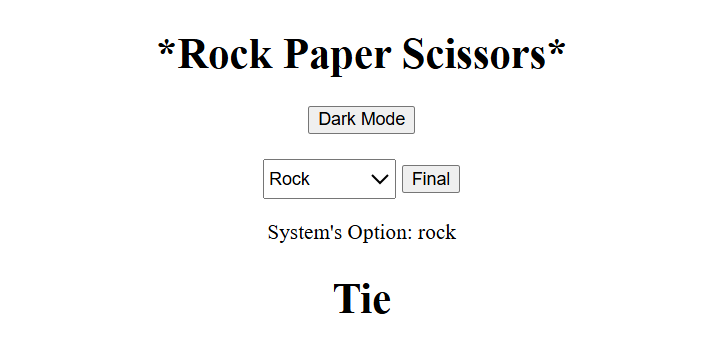
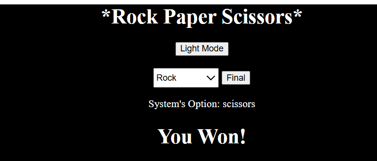

# 🪨📄✂️ Rock Paper Scissors Game

A fun browser-based Rock Paper Scissors game made using HTML, CSS, and JavaScript. The player selects Rock, Paper, or Scissors and competes against a randomly chosen system move.

---

## output

### 🤝 Tie Result (Light Mode)

### 🏆 User Win (Dark Mode)

---

## 🎮 How to Play

1. Open the `index.html` file in your browser.
2. Choose Rock, Paper, or Scissors.
3. See if you win, lose, or tie against the system!

---

## 🛠️ Technologies Used

- HTML
- CSS
- JavaScript
- No external libraries used

---

## 💡 Features

- Simple, clean UI
- Responsive design
- Light/Dark mode supported (via styling)
- Random system choice
- Real-time game result display

---

## 📂 Folder Structure

rock_paper/
├── index.html
├── index.css
├── index.js
├── output/
│ ├── tie_light_mode.png
│ └── user_win_dark_mode.png
├── README.md

---

## 📬 Author

**Manogna Anisetty**

GitHub: [@ManognaAnisetty](https://github.com/ManognaAnisetty)

---

Enjoy playing! 🎉🕹️
